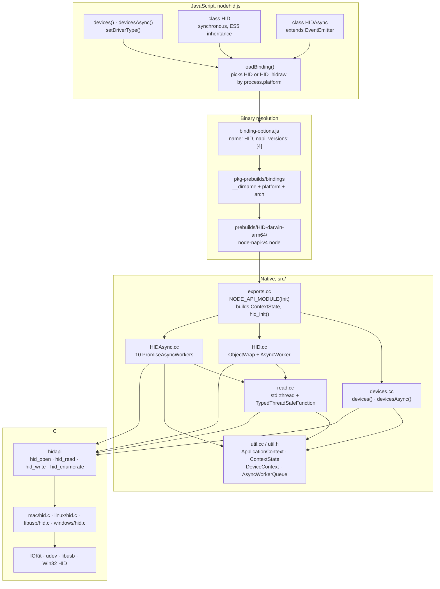
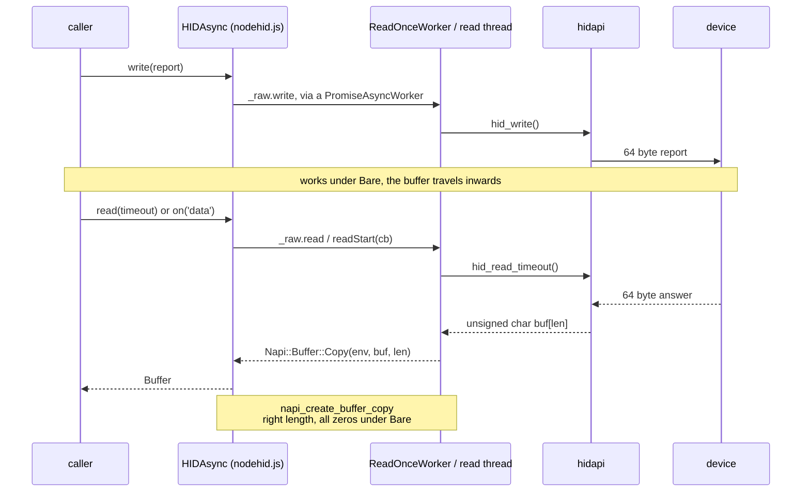
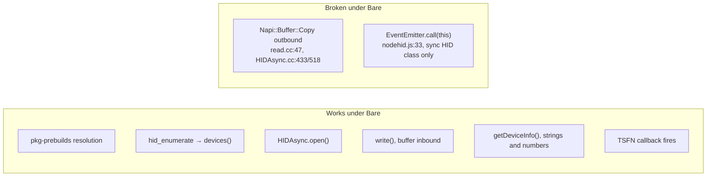

# How node-hid fits together

Read from the vendored v3.4.0 tree: `nodehid.js`, `binding-options.js`, `src/*.cc`,
`src/*.h`, `binding.gyp`. Annotated with what Bare does and does not survive; see
[PORTING.md](./PORTING.md) for the evidence.

## The stack

## One read, end to end

The path that matters for the port, and the one that breaks under Bare.

## Where Bare stands

Two failures, both narrow. The buffer copy is a libnapi defect rather than a node-hid one:
Bare's Node-API support is `holepunchto/libnapi` layered over `libjs`, so
`napi_create_buffer_copy` is the single function to look at. The `EventEmitter.call(this)`
break only affects the synchronous `HID` class, which the transport never uses.
